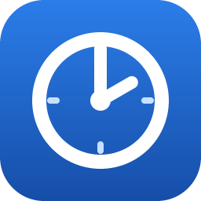
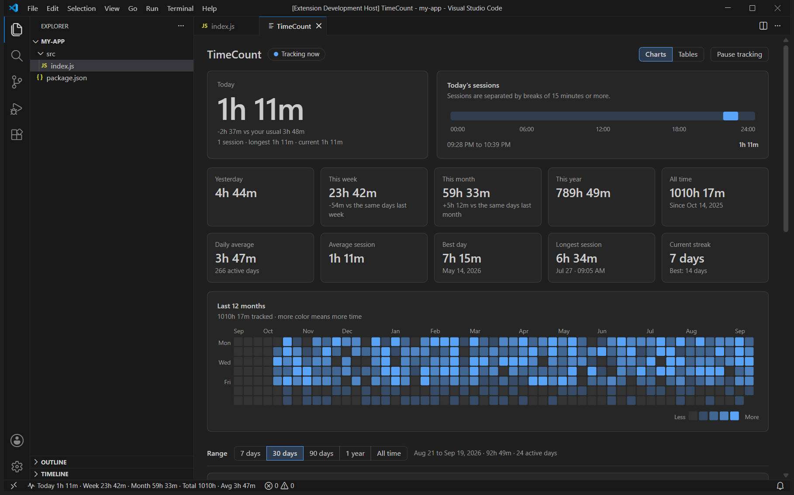
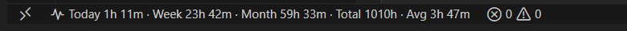
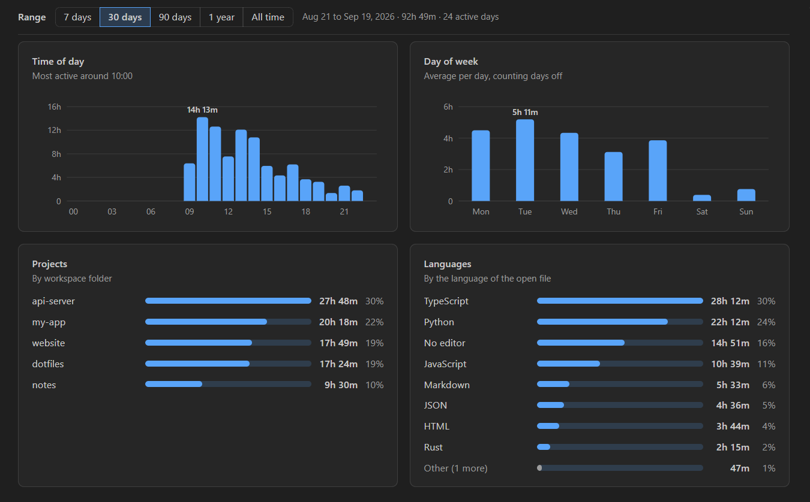
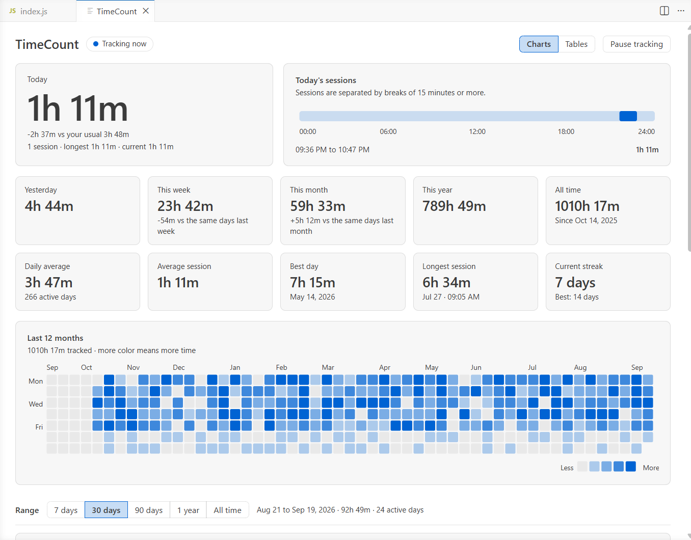

<p align="center">
  
</p>

<h1 align="center">TimeCount</h1>

<p align="center">
  See how much time you spend in VS Code, right in the status bar.<br>
  Everything stays on your computer.
</p>

<p align="center">
  <a href="https://marketplace.visualstudio.com/items?itemName=brahmjot-singh.timecount"></a>
  
  <a href="https://github.com/BrahmjotSingh0/timecount/blob/HEAD/LICENSE"></a>
  
</p>



## Install

Open the Extensions view in VS Code (`Ctrl+Shift+X`), search for **TimeCount** and click Install. You can also install it from the [Marketplace page](https://marketplace.visualstudio.com/items?itemName=brahmjot-singh.timecount), or from a terminal:

```
code --install-extension brahmjot-singh.timecount
```

There is nothing to set up. It starts counting as soon as VS Code starts. It needs VS Code 1.90 or newer.

## Status bar



By default it shows **Today**, **Week**, **Month**, **Total** and **Avg** (your average per day). Hover over it to see yesterday, this year, your best day, your streak, today's sessions and your top project and language this week. Click it to open the dashboard.

Choose what it shows with the `timecount.statusBar.items` setting: `today`, `yesterday`, `week`, `month`, `year`, `total`, `avg`, `streak`, `session` and `goal`.

## Dashboard

Open it from the status bar or with **TimeCount: Open Dashboard**.

- Today so far, compared with your usual day, with an optional daily goal
- Today's sessions on a timeline
- Yesterday, this week, this month, this year, all time, daily average, average session, best day, longest session and streak
- A heatmap of the last 12 months
- Time per day, week or month, time of day, day of week, projects and languages, for the last 7 days, 30 days, 90 days, 1 year or all time
- A Tables view that shows the same numbers as tables



It follows your VS Code theme, light or dark.



## What counts as time

TimeCount counts time while the VS Code window is in front of you. A file does not need to be open. Time in the terminal, a chat panel, the settings or the dashboard counts too, and is listed under "No editor" instead of a language.

| What is happening | Counted |
| --- | --- |
| Typing, moving the cursor, scrolling, saving, using the terminal | Yes |
| Reading or waiting with no input, for less than 5 minutes (a build, an AI agent, a long file) | Yes |
| No activity for more than 5 minutes | No, that stretch is dropped |
| VS Code is open but another app is in front | No |
| The computer is asleep | No |
| Tracking is paused | No |

The 5 minutes is the `timecount.idleTimeoutSeconds` setting. Lower it for a stricter count, or raise it if you often wait on long tasks.

Each bit of time is filed under a project (the workspace folder of the file you are in) and a language (the language of that file). To leave something out, pause tracking with **TimeCount: Pause / Resume Tracking**.

## Your data

Everything is calculated and stored on your computer. The extension has no network code, and the dashboard cannot load anything from the internet.

Time is kept in JSON files, one per month, in the extension's global storage folder. **TimeCount: Open Data Folder** opens it. On Windows that is `%APPDATA%\Code\User\globalStorage\brahmjot-singh.timecount`.

A day looks like this:

```json
"2026-09-18": {
  "total": 8040,
  "hours": [0, 0, 0, 0, 0, 0, 0, 0, 0, 1800, 2400, 1200, 0, 900, 1740, 0, 0, 0, 0, 0, 0, 0, 0, 0],
  "projects": { "my-app": 6000, "docs": 2040 },
  "languages": { "typescript": 5000, "markdown": 1500, "(no editor)": 1540 },
  "sessions": [[1789718400, 1789723200, 3400], [1789730000, 1789734640, 4640]]
}
```

Times are in seconds. `hours` is the time spent in each hour of the day, and each session is `[start, end, active seconds]` with Unix timestamps. Only dates, seconds, folder names and language names are stored. No file names, file contents or keystrokes.

If several VS Code windows are open they share the same folder. Only the focused window counts time, and each window merges what it tracked into the files instead of overwriting them.

## Settings

| Setting | Default | |
| --- | --- | --- |
| `timecount.idleTimeoutSeconds` | `300` | Seconds without activity after which you count as away (30 to 3600). |
| `timecount.weekStartsOn` | `monday` | `monday`, `sunday` or `saturday`. |
| `timecount.dailyGoalMinutes` | `0` | Daily goal in minutes. `0` turns it off. |
| `timecount.statusBar.enabled` | `true` | Show the status bar item. |
| `timecount.statusBar.items` | `today`, `week`, `month`, `total`, `avg` | What to show, in order. |
| `timecount.statusBar.alignment` | `left` | `left` or `right`. |

## Commands

- **TimeCount: Open Dashboard**
- **TimeCount: Pause / Resume Tracking**
- **TimeCount: Export Daily Totals as CSV…**
- **TimeCount: Export All Data as JSON…**
- **TimeCount: Open Data Folder**
- **TimeCount: Reset All Data…**

## Questions

**Why does it show less than the clock says?**
It only counts time when VS Code is in front of you, and it drops stretches of more than 5 minutes with no activity. It also starts counting when VS Code starts, not before.

**Does it work with remote windows (SSH, WSL, containers)?**
Yes. The extension runs on your local machine, so all your time ends up in one place.

**Does it work in VS Code for the Web?**
No, because it needs to write files.

**How do I move my history to another computer?**
Copy the data folder to the same place on the other computer while VS Code is closed.

**How do I delete my data?**
Run **TimeCount: Reset All Data…**, or delete the data folder.

## Feedback

Found a bug or have an idea? [Open an issue](https://github.com/BrahmjotSingh0/timecount/issues). See the [changelog](CHANGELOG.md) for what changed in each version.

## Development

```
npm install
npm test
npm run typecheck
npm run package
```

Press F5 in VS Code to try it in an Extension Development Host. `npm run test:integration` runs a few checks in a real VS Code window.

## License

MIT. Copyright (c) 2026 Brahmjot Singh.
